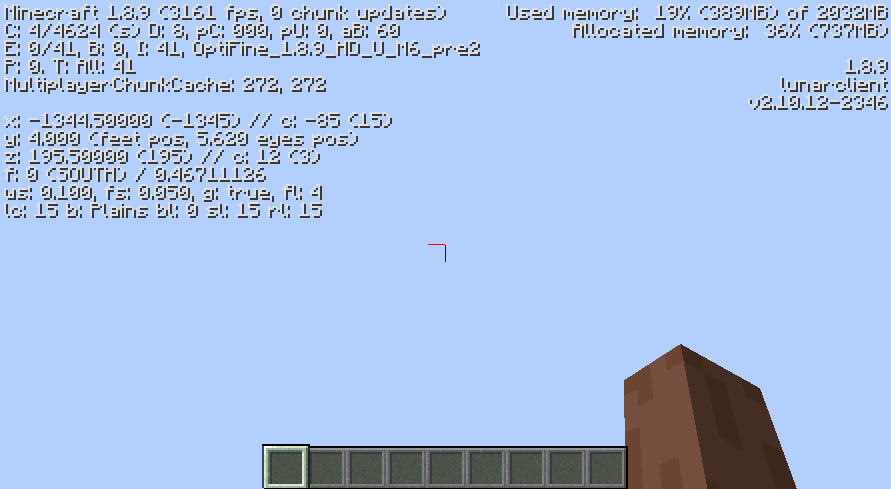

# Legacy Debug Menu
Brings back the simplified debug menu from 1.7!

---

## Image

## Installation
1. Download [Legacy Debug Menu](https://github.com/Syz66/LegacyDebugMenu/releases/latest) mod.
2. Place the jar in your Weave mods folder.
    1. Windows: `%userprofile%\.weave\mods`
    2. Unix: `~/.weave/mods`
3. Download [lunar-client-qt](https://github.com/Youded-byte/lunar-client-qt/releases/latest).

---

## Build
1. Clone the repository.
2. Run `./gradlew build` in the root directory.
3. The built jar file will be in build/libs.

## License
Legacy Debug Menu is licensed under [GNU General Public License Version 3](LICENSE).

---
